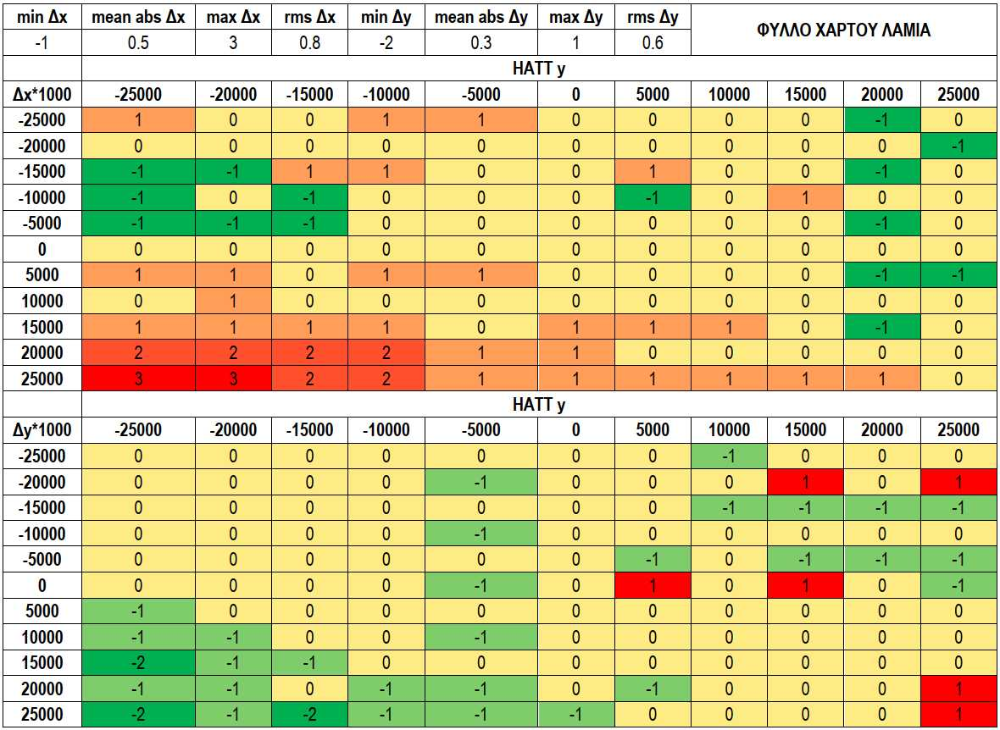

[<-Περιεχόμενα](README.md)

## **3. Επαναληπτική επίλυση με δύο παραμέτρους (σύστημα)** 

Η προαναφερόμενη μέθοδος γενικεύεται σε πολυπαραμετρικά συστήματα μη γραμμικών εξισώσεων, όπως στην περίπτωσή μας, με γραμμικοποίηση κατά Newton κάθε εξίσωσης στην περιοχή ενός σημείου (x0,y0) και αποκόπτοντας τους όρους 2<sup>ης</sup> τάξης και άνω: 

E=E(x0,y0)+ ∂E/∂x (x-x0)+∂E/∂y (y-y0), N=N(x0,y0)+ ∂N/∂x (x-x0)+∂N/∂y (y-y0) 

Η παραπάνω σχέση παριστάνεται με πίνακες ως εξής: 

```
|∂E/∂x ∂E/∂y| |x-x0| |E-E0|
|           | |    |=|    |
|∂N/∂x ∂N/∂y| |y-y0| |N-N0|
```

όπου: 

```
∂E/∂x = A1 + 2 * A3 * x + A5 * y
∂E/∂y = A2 + 2 * A4 * y + A5 * x
∂N/∂x = B1 + 2 * B3 * x + B5 * y
∂N/∂y = B2 + 2 * B4 * y + B5 * x
```

Ο πρώτος πίνακας από τα αριστερά συμβολίζεται με J (ιακωβιανός) 

```
  |∂E/∂x ∂E/∂y|   |A1+2*A3*x+A5*y  A2+2*A4*y+A5*x|
J=|           | = |                              |
  |∂N/∂x ∂N/∂y|   |B1+2*B3*x+B5*y  B2+2*B4*y+B5*x|
```

και με την προϋπόθεση ότι είναι αντιστρέψιμος (det(J) = dJ = `∂E/∂x ∂N/∂y - ∂N/∂x ∂E/∂y` <>0) ο αντίστροφος πίνακας J_1 γράφεται: 


Άρα το ανωτέρω γραμμικοποιημένο σύστημα μπορεί να γραφεί στην μορφή: 


Ας δούμε πως δουλεύει ο αλγόριθμος και τι αποτελέσματα δίνει. 

## **1η δοκιμή** 

Για x0=y0=0 οι προαναφερόμενοι πίνακες γίνονται: 

```
A1+2*A3*x+A5*y = A1
A2+2*A4*y+A5*x = A2
B1+2*B3*x+B5*y = B1
B2+2*B4*y+B5*x = B2

   |A1+2*A3*x+A5*y  A2+2*A4*y+A5*x| | 0.9996501  0.0168119|
J0=|                              |=|                     |
   |B1+2*B3*x+B5*y  B2+2*B4*y+B5*x| |-0.0167124  0.9996894|

dJ0=A1*B2-B1*A2 = 0.9996501 * 0.9996894 - (-0.0167124) * 0.0168119 = 0.9996205758765

       1  | B2+2*B4*y+B5*x  -A2-2*A4*y-A5*x|   1  | B2 -A2|
J0_1= --- |                                |= --- |       |
      dJ0 |-B1-2*B3*x-B5*y   A1+2*A3*x+A5*y|  dJ0 |-B1  A1|

              1         |0.9996894          -0.0168119         |   |1.0000688502469400 -0.0168182812616265|
J0_1= --------------- * |                                      | = |                                      |
      0.9996205758765   |0.0167124           0.9996501         |   |0.0167187434945965  1.0000295353299200|

E0 = 366746.37 + 0.9996501 * 0 + 0.0168119 * 0 +  - 0.00000000159 * 0^2 + 0.00000000054 * 0^2 + 0.00000000279 * 0 * 0 = 366746.37
N0  = 4289963.64 +  - 0.0167124 * 0 + 0.9996894 * 0 + 0.00000000295 * 0^2 + 0.00000000098 * 0^2 +  - 0.00000000522 * 0 * 0 = 4289963.64

|E0| |366746.37 |
|  |=|          |
|N0| |4289963.64|

     |E0| |1.0000688502469400 * 366746.37  -0.0168182812616265 * 4289963.64|   |294621.805478468 |
J0_1*|  |=|                                                                | = |                 |
     |N0| |0.0167187434945965 * 366746.37  +1.0000295353299200 * 4289963.64|   |4296221.88397906 |

     |E| |1.0000688502469400 * 368236.734 -0.0168182812616265 * 4306147.688|   |295840.084219181 |
J0_1*| |=|                                                                 | = |                 |
     |N| |0.0167187434945965 * 368236.734 +1.0000295353299200 * 4306147.688|   |4312431.32699368 |

     |x1|   |0 -  294621.805478468 +  295840.084219181|                        | 1218.27874071297|
     |  | = |                                         |                      = |                 |
     |y1|   |0 - 4296221.88397906  + 4312431.32699368 |                        |16209.4430146199 |
```

## **2η δοκιμή** 

Για x1=1218.27874071297, y1=16209.4430146199 οι προαναφερόμενοι πίνακες γίνονται: 

```
A1+2*A3*x+A5*y = 0.9996501 + 2 * (-1.59E-09) * 1218.27874071297 + 2.79E-09 * 16209.4430146199 = 0.999691450219616
A2+2*A4*y+A5*x = 0.0168119 + 2 * 5.4E-10 * 16209.4430146199 + 2.79E-09 * 1218.27874071297 = 1.68328051961424E-02
B1+2*B3*x+B5*y = (-0.0167124) + 2 * 2.95E-09 * 1218.27874071297 + (-5.22E-09) * 16209.4430146199 = -1.67898254479661E-02
B2+2*B4*y+B5*x = 0.9996894 + 2 * 9.8E-10 * 16209.4430146199 + (-5.22E-09) * 1218.27874071297 = 0.999714811093283

   |A1+2*A3*x+A5*y A2+2*A4*y+A5*x| |0.999691450219616  1.68328051961424E-02|
J1=|                             |=|                                       |
   |B1+2*B3*x+B5*y B2+2*B4*y+B5*x| |-1.67898254479661E-02 0.999714811093283|

dJ1= 0.999691450219616 * 0.999714811093283 - (-1.67898254479661E-02) * 1.68328051961424E-02= 0.999688969168917

              1           |0.999714811093283     -1.68328051961424E-02| |1.0000258499645   -0.0168380423464472|
J1_1= ----------------- * |                                           |=|                                     |
      0.999688969168917   |1.67898254479661E-02   0.999691450219616   | |0.016795049226085  1.00000248182262  |

E1 = 366746.37 + 0.9996501 * 1218.27874071378 + 0.0168119 * 16209.4430146273 +  (-0.00000000159) * 1218.27874071378^2 + 0.00000000054 * 16209.4430146273^2 + 0.00000000279 * 1218.27874071378 * 16209.4430146273 = 368236.928618839
N1  = 4289963.64 +  - 0.0167124 * 1218.27874071378 + 0.9996894 * 16209.4430146273 + 0.00000000295 * 1218.27874071378^2 + 0.00000000098 * 16209.4430146273^2 +  (-0.00000000522) * 1218.27874071378 * 16209.4430146273 = 4306147.84678694

|E1| | 368236.928618839|
|  |=|                 |
|N1| |4306147.846786940|

     |E1| |1.0000258499645*368236.928618839-0.0168380423464472*4306147.84678694| | 295739.34773611 |
J1_1*|  |=|                                                                    |=|                 |
     |N1| |0.016795049226085*368236.928618839+1.00000248182262*4306147.84678694| |4312343.09122509 |

     |E| |1.0000258499645   * 368236.734 -0.0168380423464472 * 4306147.688|      | 295739.155785902|
J1_1*| |=|                                                                |    = |                 |
     |N| |0.016795049226085 * 368236.734 +1.00000248182262   * 4306147.688|      |4312342.92916912 |

 
|x2| |1218.27874071297 - 295739.34773611 + 295739.155785902 |                    | 1218.08679050498|
|  |=|                                                      |                  = |                 |
|y2| |16209.4430146199 - 4312343.09122509 + 4312342.92916912|                    |16209.2809586506 |
```

## **3η δοκιμή** 

Για x1=1218.08679050498, y1=16209.2809586506 οι προαναφερόμενοι πίνακες γίνονται: 

```
A1+2*A3*x+A5*y = 0.9996501 + 2 * (-1.59E-09) * 1218.08679050498 + 2.79E-09 * 16209.2809586506 = 0.999691450377881
A2+2*A4*y+A5*x = 0.0168119 + 2 * 5.4E-10 * 16209.2809586506 + 2.79E-09 * 1218.08679050498 = 1.68328044855808E-02
B1+2*B3*x+B5*y = (-0.0167124) + 2 * 2.95E-09 * 1218.08679050498 + (-5.22E-09) * 16209.2809586506 = -1.67898257345402E-02
B2+2*B4*y+B5*x = 0.9996894 + 2 * 9.8E-10 * 16209.2809586506 + (-5.22E-09) * 1218.08679050498 = 0.999714811777633

   |A1+2*A3*x+A5*y A2+2*A4*y+A5*x| |0.999691450377881  1.68328044855808E-02|
J2=|                             |=|                                       |
   |B1+2*B3*x+B5*y B2+2*B4*y+B5*x| |-1.67898257345402E-02 0.999714811777633|

dJ2= 0.999691450377881 * 0.999714811777633 - (-1.67898257345402E-02) * 1.68328044855808E-02 = 0.999688970004169

              1           |0.999691450377881  1.68328044855808E-02| | 1.00000248114542    0.0168380416215962|
J2_1= ----------------- * |                                       |=|                                       |
      0.999688970004169   |-1.67898257345402E-02 0.999714811777633| |-0.0167950494987158  1.00002584981353  |

E2 = 366746.37 + 0.9996501 * 1218.08679050498 + 0.0168119 * 16209.2809586506 +  (-0.00000000159) * 1218.08679050498^2 + 0.00000000054 * 16209.2809586506^2 + 0.00000000279 * 1218.08679050498 * 16209.2809586506 = 368236.734000001
N2  = 4289963.64 +  - 0.0167124 * 1218.08679050498 + 0.9996894 * 16209.2809586506 + 0.00000000295 * 1218.08679050498^2 + 0.00000000098 * 16209.2809586506^2 + (-0.00000000522) * 1218.08679050498 * 16209.2809586506 = 4306147.68799999

|E2| | 368236.734000001|
|  |=|                 |
|N2| |4306147.68799999 |

     |E2|  | 1.00000248114542   * 368236.734000001 + 0.0168380416215962 *4306147.68799999| | 440744.741648171|
J2_1*|  |= |                                                                             |=|                 |
     |N2|  |-0.0167950494987158 * 368236.734000001 + 1.00002584981353  * 4306147.68799999| |4300074.44693998 |

     |E| |1.00000248114542    * 368236.734 + 0.0168380416215962 * 4306147.688|            | 440744.74164817 |
J2_1*| |=|                                                                   |           =|                 |
     |N| |-0.0167950494987158 * 368236.734 + 1.00002584981353   * 4306147.688|            |4300074.44693999 |

|x3| |1218.08679050498 - 440744.74164817  + 440744.741648171|                             | 1218.08679050597|
|  |=|                                                      |                            =|                 |
|y3| |16209.2809586506 - 4300074.44693999 + 4300074.44693998|                             |16209.2809586395 |
```

## **Σύνοψη αποτελεσμάτων:** 

 `με ευθύ υπολογισμό από HATT σε ΕΓΣΑ87:` 

`o το         (1218.087         ,16209.281        )`  `δίνει (368236.734       ,4306147.688      )`  `με επαναλήψεις από ΕΓΣΑ87 σε ΗΑΤΤ: o το         (368236.734       ,4306147.688      )`  `δίνει (                0,                0)`  `(1218.27874071297 ,16209.4430146199 )`  `(1218.08679050 498,16209.2809586 506)`  `(1218.08679050 597,16209.2809586 395)` 

Παρατηρούμε ότι ήδη από την 2<sup>η</sup> επανάληψη ο αλγόριθμος έχει προσεγγίσει την λύση με ακρίβεια καλύτερη του χιλιοστού (3<sup>ο</sup> δεκαδικό ψηφίο) και συγκεκριμένα από το 8ο δεκαδικό ψηφίο για το x και από το 7<sup>ο</sup> δεκαδικό ψηφίο για το y. 

Αυτή η παρατήρηση ελέγχεται σε όλη την επιφάνεια του φύλλου χάρτη ΓΥΣ - Λαμία με τον εξής τρόπο: 

- θεωρούμε στον χάρτη κάναβο HATT 

   - που ξεκινάει από το σημείο κάτω αριστερά (-25000, -25000) 

   - και καταλήγει στο σημείο πάνω δεξιά (25000, 25000) 

   - ενώ τα λοιπά σημεία του κανάβου επιλέγονται με βήμα μεταβολής 5000 κατά x και y 

- για κάθε σημείο του κανάβου σημειώνουμε τις συντεταγμένες (x,y) και υπολογίζουμε ευθέως τις αντίστοιχες (E,N) στο ΕΓΣΑ87 με τους πολυωνυμικούς συντελεστές Ai, Bi 

- από τις υπολογισθείσες (E,N) κρατούμε την τιμή τους μόνο μέχρι το 3<sup>ο</sup> δεκαδικό ψηφίο με στρογγυλοποίηση, ώστε να προσομοιώσουμε την περίπτωση που ένας άνθρωπος κατέχει ένα ζεύγος συντεταγμένων (E,N), τα δεκαδικά τους θα είναι 2 ή 3 το πολύ και ενδιαφέρεται να δει σε ποιο ζεύγος HATT αντιστοιχούν 

- για τις στρογγυλοποιημένες πλέον (E,N) εφαρμόζουμε τον παρόντα επαναληπτικό αλγόριθμο (ας τον ονομάσουμε Jacobi χάρην ευκολίας) μέχρι και την δεύτερη επανάληψη και καταγράφουμε τις τιμές (x2,y2) ως (x’,y’). 

- υπολογίζουμε τις διαφορές (Δx,Δy)=(x-x’,y-y’) ενισχύοντας αυτές με ένα πολλαπλασιαστικό συντελεστή 1000 ώστε να τις ελέγχουμε σε επίπεδο χιλιοστού του μέτρου. 

- πάνω στις διαφορές υπολογίζουμε: 

   - την ελάχιστη τιμή 

   - την μέγιστη τιμή 

   - την μέση απόλυτη τιμή, πχ Σ(|Δx|)/n 

   - την μέση τετραγωνική τιμή, πχ √(Σ(|Δx^2|)/n) 

Τα αποτελέσματα δίνονται στον παρακάτω πίνακα και με χρωματική διαβάθμιση. 



Η εικόνα της εσωτερικής ακρίβειας του αλγόριθμου Jacobi για το φύλλο χάρτου ΓΥΣ Λαμία είναι ικανοποιητική: 

- δίνει μέση τετραγωνική τιμή σε όλη την επιφάνεια καλύτερη από 1mm κατά x και y 

- στη νοτιοανατολική πλευρά του χάρτη (2<sup>ο</sup> τεταρτημόριο) εμφανίζονται οι μεγαλύτερες αποκλίσεις 

   - μέχρι 3mm κατά x 

   - μέχρι 2mm κατά y 

- από τα 121 ελεγχόμενα σημεία: 

   - τα 113 δίνουν απόκλιση μέχρι ±1mm κατά x 

   - τα 118 δίνουν απόκλιση μέχρι ±1mm κατά y 

Την ίδια εικόνα περίπου αναμένουμε και στα υπόλοιπα φύλλα χάρτου ΓΥΣ. 

Αυτό όμως που επισκιάζει την παραπάνω καλή εικόνα του αλγόριθμου Jacobi είναι η αδυναμία του να παράγει σταθερούς πολυωνυμικούς συντελεστές Ci_,Di_ της μορφής: 

```
x=x(E-E0,N-N0)=x(E_,N_)=C0_+C1_ E_+C2_ N_+C3_ E_^2+C4_ N_^2+C5_ E_ N_
y=y(E-E0,N-N0)=y(E_,N_)=D0_+D1_ E_+D2_ N_+D3_ E_^2+D4_ N_^2+D5_ E_ N_
```

Αν μας παρείχε αυτή τη δυνατότητα, τότε θα επιλύαμε αλγεβρικά όλες τις πράξεις μέχρι και την 2<sup>η</sup> επανάληψη και θα είχαμε εξαγάγει τους συντελεστές Ci_,Di_ ως συναρτήσεις μόνο των συντελεστών Ai,Bi. 

Δεν μας την παρέχει λόγω της εμφάνισης της ορίζουσας dJ1(E,N) (από την 1<sup>η</sup> επανάληψη), η οποία είναι συνάρτηση των Ε,Ν και εμφανίζεται στον παρανομαστή κλασματικού συντελεστή στην 2<sup>η</sup> επανάληψη, οπότε οι παραγώμενοι συντελεστές είναι συναρτήσεις των Ε και Ν. 

Παρατηρούμε όμως ότι η ορίζουσα dj υπολογίζόμενη από τον ιακωβιανό πίνακα 

- `|A1+2*A3*x+A5*y A2+2*A4*y+A5*x|` 

- `J =|                             |` 

- `|B1+2*B3*x+B5*y B2+2*B4*y+B5*x|` 

δεν αποκλίνει σημαντικά από την μονάδα (τον αριθμό 1). 

Αυτό οφείλεται στην ύπαρξη των συντελεστών Α1, που λαμβάνει τιμές 0.9991 - 1.0003, και Β2, που λαμβάνει τιμές 0.9992 - 1.0030, για όλα τα φύλλα χάρτου ΓΥΣ. 

Δεδομένου ότι η τάξη μεγέθους είναι πολύ μικρή για τους συντελεστές Α4 (10^-9 έως 10^-8), Α5 (10^-11 έως 10^-8), Β4 (10^-11 έως 10^-9) και Β5 (10^-11 έως 10^-8), ως εκ τούτου η τιμή της ορίζουσας dj μένει πρακτικά κοντά στην τιμή Α1*Β2, δηλαδή κοντά στην μονάδα. 

Αυτό μας δίνει την ιδέα ότι η dj μπορεί να γραμμικοποιηθεί στην περιοχή της μονάδας και να αρθεί με αυτό τον τρόπο η αδυναμία παραγωγής πολυωνυμικών συντελεστών ανεξάρτητων από τις συντεταγμένες Ε και Ν. 

Οι αλγεβρικές πράξεις, η επιτυχία σύγκλισης και ο έλεγχος της ακρίβειας των αποτελεσμάτων αυτού του νέου εγχειρήματος αφήνεται ως μελλοντική εργασία. 

Ας δούμε με ποιον άλλο τρόπο ξεπεράσαμε αυτό το εμπόδιο στην επόμενη παράγραφο. 
