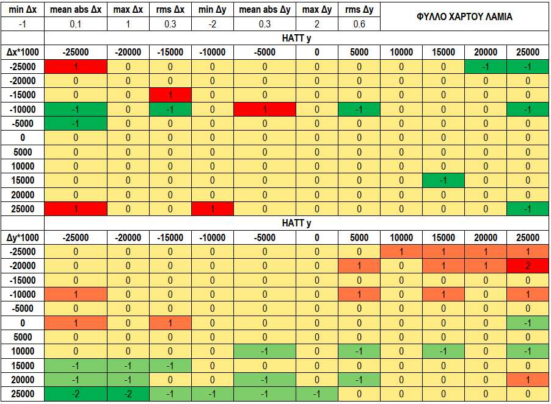

[<-Περιεχόμενα](README.md)

## **5. Έλεγχος αποκλίσεων από την χρήση των συντελεστών Ci_, Di_** 

Όπως και στην μέθοδο Jacobi, ελέγχεται όλη η επιφάνεια του φύλλου χάρτη ΓΥΣ - Λαμία με τον εξής τρόπο: 

- θεωρούμε στον χάρτη κάναβο HATT 

   - που ξεκινάει από το σημείο κάτω αριστερά (-25000, -25000) 

   - και καταλήγει στο σημείο πάνω δεξιά (25000, 25000) 

   - ενώ τα λοιπά σημεία του κανάβου επιλέγονται με βήμα μεταβολής 5000 κατά x και y 

- για κάθε σημείο του κανάβου σημειώνουμε τις συντεταγμένες (x,y) και υπολογίζουμε ευθέως τις αντίστοιχες (E,N) στο ΕΓΣΑ87 με τους πολυωνυμικούς συντελεστές Ai, Bi 

- από τις υπολογισθείσες (E,N) κρατούμε την τιμή τους μόνο μέχρι το 3<sup>ο</sup> δεκαδικό ψηφίο με στρογγυλοποίηση, ώστε να προσομοιώσουμε την περίπτωση που ένας άνθρωπος κατέχει ένα ζεύγος συντεταγμένων (E,N), τα δεκαδικά τους θα είναι 2 ή 3 το πολύ και ενδιαφέρεται να δει σε ποιο ζεύγος HATT αντιστοιχούν 

- για τις στρογγυλοποιημένες πλέον (E,N) εφαρμόζουμε τον παρόντα αλγόριθμο με τους σταθερούς συντελεστές Ci_, Di_ και καταγράφουμε τις τιμές (x’,y’). 

- υπολογίζουμε τις διαφορές (Δx,Δy)=(x-x’,y-y’) ενισχύοντας αυτές με ένα πολλαπλασιαστικό συντελεστή 1000 ώστε να τις ελέγχουμε σε επίπεδο χιλιοστού του μέτρου. 

- πάνω στις διαφορές υπολογίζουμε: 

   - την ελάχιστη τιμή 

   - την μέγιστη τιμή 

   - την μέση απόλυτη τιμή, πχ Σ(|Δx|)/n 

   - την μέση τετραγωνική τιμή, πχ √(Σ(|Δx^2|)/n) 

Τα αποτελέσματα δίνονται στον παρακάτω πίνακα και με χρωματική διαβάθμιση. 



Η εικόνα της εσωτερικής ακρίβειας του αλγόριθμου με σταθερούς συντελεστές Ci_, Di_ για το φύλλο χάρτου ΓΥΣ Λαμία είναι ικανοποιητική: 

- δίνει μέση τετραγωνική τιμή σε όλη την επιφάνεια καλύτερη από 1mm κατά x και y 

- στη νοτιοανατολική και βορειοδυτική πλευρά του χάρτη (2<sup>ο</sup> και 4<sup>ο</sup> τεταρτημόριο) εμφανίζονται οι μεγαλύτερες αποκλίσεις 

   - μέχρι 1mm κατά x 

   - μέχρι 2mm κατά y 

- από τα 121 ελεγχόμενα σημεία: 

   - τα 121 δίνουν απόκλιση μέχρι ±1mm κατά x 

   - τα 118 δίνουν απόκλιση μέχρι ±1mm κατά y 

Την ίδια εικόνα περίπου αναμένουμε και στα υπόλοιπα φύλλα χάρτου ΓΥΣ. 

```
Function in_ac(A, B, C, D)
Dim xh(1 To 11) As Double, yh(1 To 11) As Double
Dim dx(1 To 11, 1 To 11) As Double, dy(1 To 11, 1 To 11) As Double
Dim res(1 To 18) As Double
    'Έναρξη κανάβου
    For i = 1 To 11
        xh(i) = -25000 + 5000 * (i - 1)
        yh(i) = xh(i)
    Next i
    'Υπολογισμός Ε0=Α0, Ν0=Β0
    E0 = WorksheetFunction.MMult(A, WorksheetFunction.Transpose(xy(0, 0)))(1)
    N0 = WorksheetFunction.MMult(B, WorksheetFunction.Transpose(xy(0, 0)))(1)
    'Έναρξη βοηθητικών μεταβλητών
    absxm = 0: absym = 0
    less1x = 0: less1y = 0
    'Σε κάθε σημείο του κανάβου υπολόγισε
    For i = 1 To 11
        For J = 1 To 11
            'Ε_=Ε-Ε0 και Ν_=Ν-Ν0 με 3 δεκαδικά από τα πολυώνυμα ΗΑΤΤ
            E_ = WorksheetFunction.MMult(A, WorksheetFunction.Transpose(xy(xh(i),
yh(J))))(1) - E0: E_ = Round(E_, 3)
            N_ = WorksheetFunction.MMult(B, WorksheetFunction.Transpose(xy(xh(i),
yh(J))))(1) - N0: N_ = Round(N_, 3)
            'διαφορές ΗΑΤΤ dx,dy μεγενθυμένες κατά 1000 με ένα δεκαδικό (0.0mm)
            dx(i, J) = Round(1000 * (xh(i) - WorksheetFunction.MMult(C,
WorksheetFunction.Transpose(EN(E_, N_)))(1)), 2)
            dy(i, J) = Round(1000 * (yh(J) - WorksheetFunction.MMult(D,
WorksheetFunction.Transpose(EN(E_, N_)))(1)), 2)
            'Απόλυτη μέση τιμή dx, dy
            absxm = absxm + Abs(dx(i, J)): absym = absym + Abs(dy(i, J))
            'πλήθος σημείων με |dx|, |dy| καλύτερο από 1mm
            If (Abs(dx(i, J)) <= 1) Then less1x = less1x + 1
            If (Abs(dy(i, J)) <= 1) Then less1y = less1y + 1
        Next J
    Next i
    absxm = absxm / 121: absym = absym / 121
    'επέστρεψε τα στατιστικά σαν διάνυσμα 10 παραμέτρων
    res(1) = WorksheetFunction.Min(dx)
    res(2) = WorksheetFunction.Max(dx)
    res(3) = absxm
    res(4) = WorksheetFunction.SumSq(dx) ^ 0.5 / 11
    res(5) = less1x
    res(6) = WorksheetFunction.Min(dy)
    res(7) = WorksheetFunction.Max(dy)
    res(8) = absym
    res(9) = WorksheetFunction.SumSq(dy) ^ 0.5 / 11
    res(10) = less1y
    For i = 1 To 11
        For J = 1 To 11
            If (res(1) = dx(i, J)) Then
                res(11) = xh(i)
                res(12) = yh(J)
            End If
            If (res(2) = dx(i, J)) Then
                res(13) = xh(i)
                res(14) = yh(J)
            End If
            If (res(6) = dy(i, J)) Then
                res(15) = xh(i)
                res(16) = yh(J)
            End If
            If (res(7) = dy(i, J)) Then
                res(17) = xh(i)
                res(18) = yh(J)
            End If
        Next J
    Next i
    in_ac = res
End Function

Function xy(x, y)
    Dim vec(1 To 6) As Double
    vec(1) = 1: vec(2) = x: vec(3) = y: vec(4) = x * x: vec(5) = y * y: vec(6) = x * y
    xy = vec
End Function
```

Στον παραπάνω πίνακα δίνεται συνάρτηση VBA excel που μας διευκολύνει στον μαζικό έλεγχο όλων των φύλλων χάρτη. 

Ακολουθεί ανάλυση σφάλματος για 390 φύλλα χάρτου ταυτόχρονα. 

Με δείκτη τον αριθμό ΦΧ στον οριζόντιο άξονα απεικονίζουμε σε γράφημα τα μέγιστα θετικά και αρνητκά σφάλματα κατά x και y. Διαπιστώνουμε ότι: 

- κατά τον άξονα x τα ΦΧ 25 (ΑΚΡΑ ΠΑΞΙΜΑΔΙ), 77Α (ΓΑΥΡΙΟΝ-ΒΟΡ.ΤΜΗΜΑ) και 244 (ΝΗΣΟΣ ΑΝΑΦΗ), εμφανίζουν μέγιστο σφάλμα ±88mm, ±88mm και ±14mm, αντίστοιχα 

- κατά τον άξονα y τα ΦΧ 25 (ΑΚΡΑ ΠΑΞΙΜΑΔΙ) και 77Α (ΓΑΥΡΙΟΝ-ΒΟΡ.ΤΜΗΜΑ), εμφανίζουν μέγιστο σφάλμα ±105mm και ±105mm, αντίστοιχα 

- ο έλεγχος δείχνει ότι δεν υπάρχει χονδροειδές σφάλμα κατά την ψηφιοποίηση των συντελεστών Ai, Bi, ίσως να υπάρχει χονδροειδές σφάλμα στην εκτύπωση του βιβλίου του ΟΚΧΕ 

- σε όλα τα υπόλοιπα ΦΧ τα μέγιστα σφάλματα είναι μικρότερα από 4mm και στους 2 άξονες HATT 


<!-- Start of picture text -->
ApiOydcOX<br>0 20 «40 60 80 100 120 140 160 180 200 220 240 260 280 300 320 340 360 380<br>100.00<br>.<br>80.00<br>60.00<br>40.00<br>20.00<br>.<br>E£ 0.00 Shptenemeetpom panes eeseaennertent qe pmeeeesiytepemtee% mpeg<br>.<br>-20.00<br>~40.00<br>-60.00<br>-80.00<br>° A<br>100.00<br>e@mindx « maxdx<br>0 AptOpdcOX<br>20 40 60 80 100 120 140 160 180 200 220 240 260 280 300 320 340 360 380<br>150.00<br>100.00 . bs<br>50.00<br>€0.00 cfepettetmenteetemnsened teeny terete eT TEI<br>—<br>-50.00<br>-100.00<br>° .<br>-150.00<br><!-- End of picture text -->

mindy maxdy 


<!-- Start of picture text -->
AptOpdcOX<br>0 20 40 60 80 100 120 140 160 180 200 220 240 260 280 300 320 340 360 380<br>20.00<br>15.00<br>.<br>10.00<br>5.00<br>$°<br>.<br>. Ce ., . .<br>e e e e ° * e @e<br>le<br>:<br>-5.00 °<br>-10.00<br>-15.00 °<br>20.00<br>@mindx © maxdx<br>0 20 40 60 80 100 120 140 160 180Api8pdc200OX 220 240 260 280 300 320 340 360 380<br>20.00<br>15.00<br>10.00<br>5.00<br>ry<br>.°<br>oo ° of, ae! ° este% 8 o & 8, one? . d<br>& ° ° Po Me ° * °<br>E .: . a, ee °<br>5.00<br>-10.00<br>-15.00<br>-20.00<br><!-- End of picture text -->


<!-- Start of picture text -->
mindy © maxdy<br><!-- End of picture text -->


<!-- Start of picture text -->
dxmin<br>yHATT<br>-25000 -20000 -15000 -10000 -5000 0 5000 10000 15000 20000 25000<br>-25000 4 0 2 6 6 23 5 3 1 4 2<br>-20000 0 0 0 0 0 0 0 0 0 0 4<br>-15000 2 2 1 0 0 0 0 0 1 0 2<br>-10000 0 1 0 0 0 0 0 0 0 0 2<br>-5000 0 0 0 0 0 0 0 0 0 0 0<br>0 0 0 3 0 0 0 0 0 0 0 0<br>5000 6 4 2 0 0 0 0 0 0 0 1<br>10000 7 0 0 0 0 0 0 0 3 0 21<br>15000 5 1 2 0 0 0 0 0 0 10 10<br>20000 16 4 2 0 0 0 5 0 1 0 42<br>25000 57 10 1 1 5 0 0 2 4 7 87<br>dxmax<br>yHATT<br>-25000 -20000 -15000 -10000 -5000 0 5000 10000 15000 20000 25000<br>-25000 44 18 1 0 0 0 5 0 2 13 59<br>-20000 31 0 1 0 0 0 0 0 4 0 48<br>-15000 5 3 0 0 0 0 0 0 0 5 17<br>-10000 9 0 0 0 0 0 0 0 0 0 9<br>-5000 0 0 0 0 0 0 0 0 0 0 2<br>0 0 0 0 0 0 0 0 0 0 0 1<br>5000 1 0 0 0 0 0 0 0 0 0 0<br>10000 1 0 0 0 0 0 0 0 1 0 0<br>15000 0 0 0 0 2 0 0 0 2 0 1<br>20000 4 0 0 0 1 0 0 0 0 0 1<br>25000 5 1 1 4 9 24 11 9 12 7 16<br>dymin<br>yHATT<br>-25000 -20000 -15000 -10000 -5000 0 5000 10000 15000 20000 25000<br>-25000 70 28 18 14 0 0 0 0 2 1 0<br>-20000 30 0 2 0 0 0 0 0 0 0 1<br>-15000 4 2 0 0 0 0 0 0 0 0 1<br>-10000 0 0 0 0 0 0 0 0 0 0 0<br>-5000 0 0 0 0 0 0 0 0 0 0 3<br>0 3 0 0 0 0 0 0 0 0 0 10<br>5000 0 0 0 0 0 0 0 0 0 0 0<br>10000 0 0 0 0 0 0 0 0 0 0 2<br>15000 0 0 3 1 0 0 0 0 5 0 2<br>20000 9 0 7 0 6 0 0 0 5 0 1<br>25000 81 22 22 16 1 2 0 4 1 4 7<br>dymax<br>yHATT<br>-25000 -20000 -15000 -10000 -5000 0 5000 10000 15000 20000 25000<br>-25000 2 0 0 3 0 0 0 10 15 22 66<br>-20000 1 0 0 0 0 0 0 0 0 0 13<br>-15000 1 0 0 0 0 0 0 0 0 1 0<br>-10000 4 0 0 0 0 0 0 0 0 0 3<br>-5000 1 0 0 0 0 0 0 0 0 0 2<br>0 5 0 4 0 0 0 0 0 0 0 0<br>5000 7 1 0 0 0 0 0 0 0 0 3<br>10000 0 0 0 0 0 0 0 0 0 0 0<br>15000 0 0 0 0 0 0 0 0 0 3 0<br>20000 2 0 0 0 0 0 0 0 1 1 34<br>25000 3 5 0 1 0 2 0 22 23 40 89<br>xHATT<br>xHATT<br>xHATT<br>xHATT<br><!-- End of picture text -->

Για να έχουμε και μια χωρική πληροφορία κατανομής των σφαλμάτων τοποθετήσαμε, πάνω στον εικονικό κάναβο τα σημεία με τα μέγιστα σφάλματα και αποκτήσαμε μια εικόνα της επιφανειακής πυκνότητας των σφαλμάτων. Τα πιο πολλά σφάλματα συσσωρεύονται στις 4 ακραίες γωνίες του κανάβου ενώ καταλαμβάνουν και τις περιφερειακές λωρίδες, με μικρότερη όμως πυκνότητα. 
